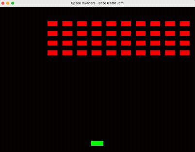

# 👾 Space Invaders Code Challenge 👾

This is the base code for the Space Invaders Code Challenge, where participants will refine a small bare bones game in just 10-12 hours.  

## Video of the base game



## Features of base game

- Basic window handling and game loop setup using C++ with SFML  
- Movable Player object (green rectangle) that can also shoot lazer beams  
- Automatically moving group of Enemies (red rectangles) that gradually progress their way down the screen  

## Setup information

1. You need to have Git and CMake installed in order to use this program.

2. **If you use Linux**, install SFML's dependencies using your system package manager. On Ubuntu and other Debian-based distributions you can use the following commands:
   ```
   sudo apt update
   sudo apt install \
       libxrandr-dev \
       libxcursor-dev \
       libxi-dev \
       libudev-dev \
       libfreetype-dev \
       libflac-dev \
       libvorbis-dev \
       libgl1-mesa-dev \
       libegl1-mesa-dev \
       libfreetype-dev
   ```


3. To build the game, use CMake from the command line with these commands:

   ```
   cmake -B build
   cmake --build build
   ```
   
   After running these commands, run the game executable with  

    ```./build/bin/space_invaders```

5. **IMPORTANT NOTE:**  
   If you add new source files to the program, remeber to first do ```cmake -B build```, as it prepares the build information and thus updates needed source files.
